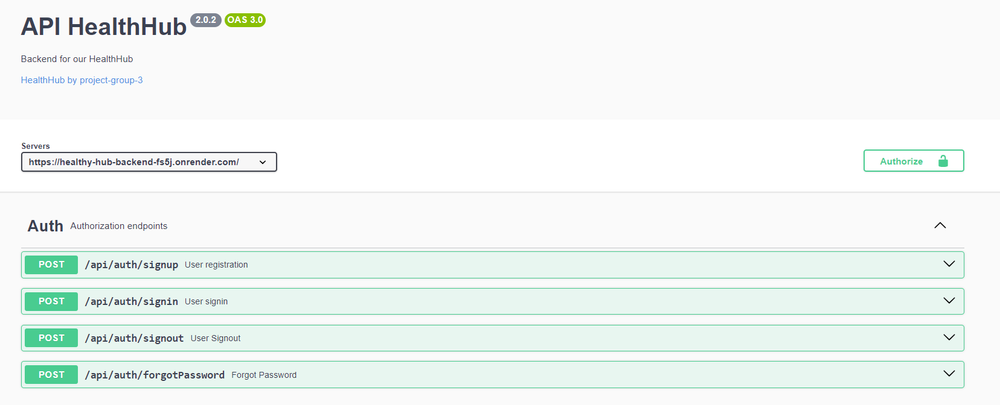

# Backend - Healthy Hub - FS84 - ProjectGroup 3

This readme provides an overview of the backend application's functionality, including authentication, login, password change, avatar management, and daily intake calculations for calories, micronutrients, and water. It also covers weight tracking and the recording and processing of food intake, water consumption, and calorie counts.

- 🔗 API_URL - https://healthy-hub-backend-fs5j.onrender.com
- 📄 API_DOCS(Swagger) - https://healthy-hub-backend-fs5j.onrender.com/api-docs

- 🖼️ FRONTEND - https://songlad.github.io/HEALTH_EN/
- ✨ FRONTEND REPO - https://github.com/SonGlad/HEALTH_EN

## Developers

- **Team Lead of Backend:** [Ivan Sheremeta](https://github.com/Sheremeta-Ivan)
- **Developer:** [Daniil Drozd](https://github.com/DaniilDrozd)

## Technologies

  <b>HealthyHub backend part is built using the following technologies & tools:</b>

  &nbsp;
  &nbsp;
  &nbsp;
  &nbsp;
  &nbsp;
  &nbsp;
  &nbsp;
  &nbsp;

## Table of Contents

- [Authentication](#authentication)
- [Login](#login)
- [Password Change](#password-change)
- [Avatar Management](#avatar-management)
- [Daily Intake Calculation](#daily-intake-calculation)
- [Weight Tracking](#weight-tracking)
- [Food Intake Recording](#food-intake-recording)
- [Water Consumption Recording](#water-consumption-recording)
- [Calorie Count Recording](#calorie-count-recording)
- [Swagger Documentation](#swager)

## Authentication

The backend implements user authentication using JSON Web Tokens (JWT). When a user registers or logs in, a token is generated and sent to the client. Subsequent requests to authenticated endpoints must include this token in the headers to authorize the user.

## Login

Users can log in using their email and password. The backend validates the credentials, and upon successful login, a JWT token is provided for authorization.

## Password Change

Users can change their password by providing their current password and a new password. The backend verifies the current password and updates it if the validation is successful.

## Avatar Management

Users can upload and manage their avatars. The backend stores the avatar images and provides endpoints to retrieve and update user avatars.

## Daily Intake Calculation

The application calculates the user's daily intake requirements for calories, micronutrients, and water-based on factors such as age, weight, height, activity level, and goals. This information is used to provide personalized recommendations for the user.

## Weight Tracking

Users can track and monitor their weight over time. The backend stores weight entries with timestamps, allowing users to visualize their weight change progress.

## Food Intake Recording

The application allows users to record and track their food intake. Users can log meals, and the backend processes this information to calculate daily calorie intake and nutrient distribution.

## Water Consumption Recording

Users can record their daily water consumption. The backend tracks water intake entries, providing insights into daily hydration levels.

## Calorie Count Recording

In addition to calculating daily caloric intake, the application records users' calorie consumption from logged meals. This information is useful for users monitoring their calorie balance.

## Swagger Documentation

